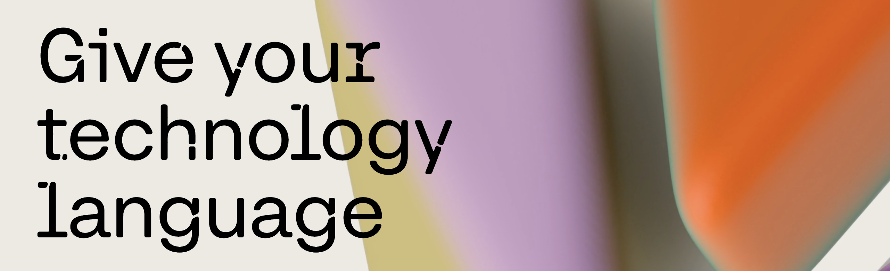

# Cohere TypeScript SDK



[](https://www.npmjs.com/package/cohere-ai)
[](https://github.com/fern-api/fern)

The Cohere Typescript SDK allows access to Cohere models across many different platforms: the cohere platform, AWS (Bedrock, Sagemaker), Azure, GCP and Oracle OCI. For a full list of support and snippets, please take a look at the [SDK support docs page](https://docs.cohere.com/docs/cohere-works-everywhere).

## Documentation

Cohere documentation and API reference is available [here](https://docs.cohere.com/).

## Installation

```
npm i -s cohere-ai
```

## Usage

```typescript
import { CohereClientV2 } from "cohere-ai";

const cohere = new CohereClientV2({});

(async () => {
  const response = await cohere.chat({
    model: 'command-a-03-2025',
    messages: [
      {
        role: 'user',
        content: 'hello world!',
      },
    ],
  });

  console.log(response);
})();
```

## Streaming

The SDK supports streaming endpoints. To take advantage of this feature for chat,
use `chatStream`.

```typescript
import { CohereClientV2 } from "cohere-ai";

const cohere = new CohereClientV2({});

(async () => {
  const stream = await cohere.chatStream({
    model: 'command-a-03-2025',
    messages: [
      {
        role: 'user',
        content: 'hello world!',
      },
    ],
  });

  for await (const chatEvent of stream) {
    if (chatEvent.type === 'content-delta') {
      console.log(chatEvent.delta?.message);
    }
  }
})();
```

## Errors

When the API returns a non-success status code (4xx or 5xx response),
a subclass of [CohereError](./src/errors/CohereError.ts) will be thrown:

```TypeScript
import { CohereClientV2, CohereError, CohereTimeoutError } from "cohere-ai";

const cohere = new CohereClient({
    token: "YOUR_API_KEY",
});

(async () => {
    try {
        await cohere.generate(/* ... */);
    } catch (err) {
        if (err instanceof CohereTimeoutError) {
            console.log("Request timed out", err);
        } else if (err instanceof CohereError) {
            // catch all errors
            console.log(err.statusCode);
            console.log(err.message);
            console.log(err.body);
        }
    }
})();
```

## Beta status

This SDK is in beta, and while we will try to avoid it, there may be breaking changes between versions without a major version update. Therefore, we recommend pinning the package version to a specific version in your package.json file. This way, you can install the same version each time without breaking changes unless you are intentionally looking for the latest version.

## Contributing

While we value open-source contributions to this SDK, the code is generated programmatically. Additions made directly would have to be moved over to our generation code, otherwise they would be overwritten upon the next generated release. Feel free to open a PR as a proof of concept, but know that we will not be able to merge it as-is. We suggest opening an issue first to discuss with us!

On the other hand, contributions to the README are always very welcome!
