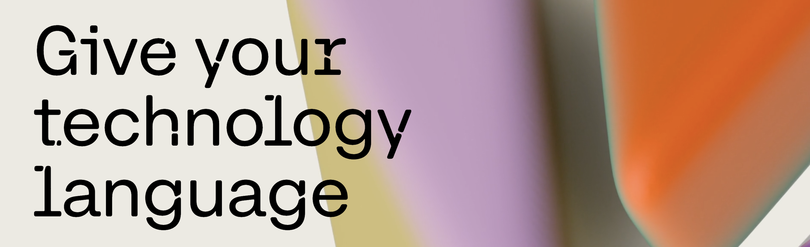

# Cohere TypeScript SDK



[](https://www.npmjs.com/package/cohere-ai)
[](https://github.com/fern-api/fern)

The Cohere TypeScript SDK provides access to Cohere models across multiple platforms: Cohere Platform, AWS (Bedrock, SageMaker), Azure, GCP, and Oracle OCI. For a full support matrix and code snippets, see the [SDK support docs page](https://docs.cohere.com/docs/cohere-works-everywhere).

## Documentation

Cohere documentation and API reference are available [here](https://docs.cohere.com/).

## Installation

```bash
npm install cohere-ai
```

## Usage (Recommended: v2)

Reasoning models require the `v2/chat` endpoint. Use `CohereClientV2` for reasoning-capable chat requests.
For backward compatibility, `CohereClient` continues to use the legacy `v1/chat` endpoint.

```typescript
import { CohereClientV2 } from "cohere-ai";

const cohere = new CohereClientV2({});

(async () => {
  const response = await cohere.chat({
    model: "command-a-03-2025",
    messages: [
      {
        role: "user",
        content: "hello world!",
      },
    ],
  });

  console.log(response);
})();
```

## Streaming

The SDK supports streaming endpoints. For chat streaming, use `chatStream`.

```typescript
import { CohereClientV2 } from "cohere-ai";

const cohere = new CohereClientV2({});

(async () => {
  const stream = await cohere.chatStream({
    model: "command-a-03-2025",
    messages: [
      {
        role: "user",
        content: "hello world!",
      },
    ],
  });

  for await (const chatEvent of stream) {
    if (chatEvent.type === "content-delta") {
      console.log(chatEvent.delta?.message);
    }
  }
})();
```

## Errors

When the API returns a non-success status code (4xx or 5xx response),
a subclass of [CohereError](./src/errors/CohereError.ts) is thrown.

```typescript
import { CohereClientV2, CohereError, CohereTimeoutError } from "cohere-ai";

const cohere = new CohereClientV2({
  token: "YOUR_API_KEY",
});

(async () => {
  try {
    await cohere.chat({
      model: "command-a-03-2025",
      messages: [{ role: "user", content: "Hello" }],
    });
  } catch (err) {
    if (err instanceof CohereTimeoutError) {
      console.log("Request timed out", err);
    } else if (err instanceof CohereError) {
      console.log(err.statusCode);
      console.log(err.message);
      console.log(err.body);
    }
  }
})();
```

## AWS Support (Bedrock & SageMaker)

To use Cohere models on AWS Bedrock or SageMaker, import the AWS clients from the `cohere-ai/aws` subpath and install the required peer dependencies:

```
npm install @aws-sdk/credential-providers @aws-crypto/sha256-js @smithy/protocol-http @smithy/signature-v4
```

```typescript
import { BedrockClient } from "cohere-ai/aws";

const cohere = new BedrockClient({
  awsRegion: "us-east-1",
});

const response = await cohere.chat({
  model: "cohere.command-a-03-2025",
  messages: [{ role: "user", content: "hello world!" }],
});
```

The following clients are available from `cohere-ai/aws`:

- `BedrockClient` / `BedrockClientV2` - AWS Bedrock
- `SagemakerClient` / `SagemakerClientV2` - AWS SageMaker
- `AwsClient` / `AwsClientV2` - Base AWS client

The AWS dependencies are optional peer dependencies and are only required if you use the AWS clients. They will not be installed automatically.

## Beta status

This SDK is in beta, and while we will try to avoid it, there may be breaking changes between versions without a major version update. Therefore, we recommend pinning the package version to a specific version in your package.json file. This way, you can install the same version each time without breaking changes unless you are intentionally looking for the latest version.

## Contributing

While we value open-source contributions to this SDK, the code is generated programmatically. Additions made directly would have to be moved over to our generation code, otherwise they would be overwritten upon the next generated release. Feel free to open a PR as a proof of concept, but know that we will not be able to merge it as-is. We suggest opening an issue first to discuss with us!

On the other hand, contributions to the README are always very welcome!
